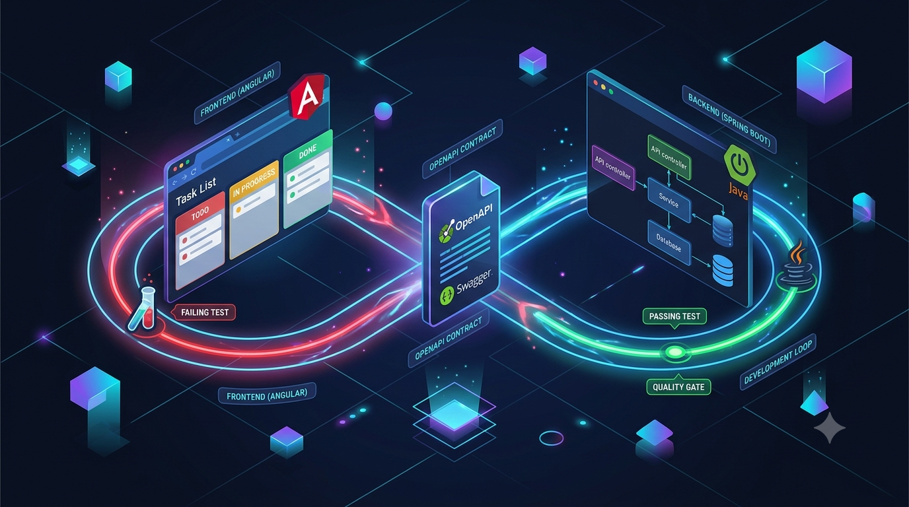

# Fullstack Loop

[](https://github.com/arnaudgelas/fullstack-loop/actions/workflows/pr-validate.yml)
[](https://github.com/arnaudgelas/fullstack-loop/actions/workflows/nightly.yml)
[](https://github.com/arnaudgelas/fullstack-loop/actions/workflows/release.yml)
[](LICENSE)



A reference full-stack repository built around one idea: **the test you write first
determines the design you end up with.** An Angular frontend and a Spring Boot backend
are joined by a single OpenAPI contract, and every layer of the system is driven from a
failing test at the appropriate altitude.

The stack is deliberately small — a Task list — because the point of this repository is
the development loop and the quality gates, not the domain.

---

## The loop

Three nested feedback rings. Each ring is slower and more integrated than the one inside
it, so you spend most of your time in the fastest ring that can still tell you the truth.

```
                    [ Feature / Acceptance Scenario ]
              Example-driven behaviour, written as a business outcome
                                    │
                                    ▼
        ╔═══════════════════════════════════════════════════════╗
        ║  OUTER LOOP — BDD / ACCEPTANCE                        ║
        ║  A failing Cucumber scenario 🔴                        ║
        ║  Executable acceptance criterion, below browser level ║
        ╚═══════════════════════════┬═══════════════════════════╝
                                    ▼
                         [ OpenAPI Contract Change ]
                    The canonical HTTP definition changes FIRST
                                    │
                                    ▼
                    [ Strict Contract Lint ]  ── Redocly, zero overrides
                                    │
                                    ▼
                         [ Code Generation ]
                     ┌──────────────┴──────────────┐
                     ▼                             ▼
          [ Angular API Client ]        [ Spring API Interface ]
            generated, never             generated, never
              hand-edited                  hand-edited
                     │                             │
                     │      consumer-driven        │
                     ├────▶ [ Pact Contract ] ────▶│
                     │                             │
                     └──────────────┬──────────────┘
                                    ▼
                  [ Fast Local Development Environment ]
              Docker Compose for the stack, Testcontainers for tests
                              MongoDB
                                    │
              ┌─────────────────────┴─────────────────────┐
              ▼                                           ▼

   ┌────────────────────────────┐          ┌────────────────────────────┐
   │ MIDDLE LOOP — WEB ADAPTER  │          │ MIDDLE LOOP — COMPONENT    │
   │ Failing @WebMvcTest 🔴     │          │ Failing component test 🔴  │
   │            │               │          │ Testing Library            │
   │            ▼               │          │            │               │
   │ ┌────────────────────────┐ │          │            ▼               │
   │ │ INNER LOOP — UNIT TDD  │ │          │ ┌────────────────────────┐ │
   │ │ Domain unit test 🔴    │ │          │ │ INNER LOOP — UNIT TDD  │ │
   │ │ JUnit + AssertJ        │ │          │ │ Pure logic test 🔴     │ │
   │ │          │             │ │          │ │ Vitest                 │ │
   │ │          ▼             │ │          │ │          │             │ │
   │ │ Domain implementation  │ │          │ │          ▼             │ │
   │ │ RED → GREEN → REFACTOR │ │          │ │ Logic implementation   │ │
   │ │          └──── 🟢 ─────┘ │          │ │ RED → GREEN → REFACTOR │ │
   │ └────────────┬───────────┘ │          │ │          └──── 🟢 ─────┘ │
   │              ▼             │          │ └────────────┬───────────┘ │
   │   Web slice becomes 🟢     │          │   Component becomes 🟢     │
   └──────────────┬─────────────┘          └──────────────┬─────────────┘
                  ▼                                       ▼
    [ Provider Pact Verification ]          [ Consumer Pact Generation ]
    Verify the interactions the             Record what the consumer
    consumer actually requires              actually requires
                  │                                       │
                  ▼                                       ▼
    [ Integration Test ]                    [ Feature / UI Integration ]
    Testcontainers, clean state             Generated client + component
                  │                                       │
                  └───────────────────┬───────────────────┘
                                      ▼
                   [ BDD Acceptance Scenario becomes 🟢 ]
                                      │
                                      ▼
                        REFACTOR — simplify safely
                                      │
                    └──── Next scenario / example → 🔴 ────┘


                                      │
                                      ▼
                       [ Fast Pull-Request Validation ]
         Type check • lint • unit • slice • Cucumber • Pact • integration
                                      │
                    ┌─────────────────┴─────────────────┐
                    ▼                                   ▼
          [ Scoped Mutation Tests ]           [ Packaging Validation ]
            PIT + Stryker                       Container builds
          incremental on PRs,                   Helm lint / template
          broader periodically
                    │                                   │
                    └─────────────────┬─────────────────┘
                                      ▼
                        [ Deployment Validation Loop ]
                           Local cluster: Kind OR K3d
                                      │
                                      ▼
                          [ Helm Upgrade / Install ]
                                      │
                                      ▼
                          [ Playwright Acceptance ]
                      Critical browser journeys only —
                  deployment confirmation, NOT the primary
                        BDD development feedback loop
                                      │
                                      ▼
                     [ Automated Accessibility Checks ]
                   axe-core — regression detection, NOT a
                      complete WCAG conformance audit
```

### Why the rings are ordered this way

**The contract changes before the code.** `openapi/openapi.yaml` is the single source of
truth. The Angular client and the Spring server interface are both *generated* from it and
are never hand-edited — neither is committed to git. This means the two sides cannot drift
by accident: they can only drift if someone changes the contract, and that change is
visible in review.

**Pact covers what OpenAPI cannot.** A schema says a field *may* exist. A pact says this
consumer *actually depends on it*. The contract prevents shape mismatches; the pact
prevents the backend from removing something the frontend silently relies on.

**Cucumber sits below the browser.** Acceptance scenarios run against the HTTP boundary
with a real database, not through a browser. Browser tests are slow and flaky enough that
using them as the primary development feedback loop poisons the whole cycle. Playwright
appears once, at the end, over a deployed stack, for a small number of critical journeys.

**Mutation testing asks the question coverage cannot.** Line coverage proves a line ran.
Mutation testing proves a test would have *failed* had that line been wrong. It is scoped
and incremental on pull requests because it is expensive.

---

## Architecture

```
Browser ──▶ nginx (frontend image) ──┬──▶ static Angular bundle
                                     └──▶ /api/* proxied ──▶ Spring Boot ──▶ MongoDB
```

The frontend container serves the compiled bundle and reverse-proxies `/api/` to the
backend, so the browser only ever talks to one origin. The Angular client therefore uses
a relative base path, and the contract declares a single relative server.

Backend layering is enforced, not merely documented — an ArchUnit test fails the build if
the domain package acquires a dependency on Spring, on the web adapter, or on persistence:

```
web  ──▶ domain ◀── persistence
            ▲
     no framework types,
     no adapter imports
```

### Authentication

Every `/api/**` operation requires an RS256 bearer JWT; `/actuator/health` is public.
The backend is an OAuth2 resource server validating signature, expiry, issuer
(`https://auth.fullstack-loop.local/`) and audience (`fullstack-loop-api`), with `tasks:read` required for
reads and `tasks:write` for writes. 401 and 403 return `application/json` bodies matching
the contract's `Problem` schema rather than Spring's default empty response.

Development keys are **generated, never committed** (`scripts/gen-dev-keys.sh` →
`dev-keys/`, gitignored). In a deployed environment the backend points at an identity
provider's JWKS endpoint instead; only configuration changes. Full details in `AUTH.md`.

---

## Repository layout

```
openapi/openapi.yaml    The contract. Source of truth. Everything else follows it.
backend/                Spring Boot provider (Java 21, Maven)
frontend/               Angular consumer (Node 22, Angular 20)
tools/codegen/          Lint + code generation toolchain image
e2e/                    Playwright + axe-core browser acceptance
ci/                     Pull-request validation gate image
scripts/                Development helpers
docker-compose.yml      The local stack
AUTH.md                 Authentication design — binding across components
QUALITY-GATES.md        Quality bar — binding across components
DOCKER-CONVENTIONS.md   Image and build conventions — binding across components
```

---

## Prerequisites

- Docker with BuildKit (the images are the only hard requirement)
- For the host-side fast loop: **JDK 21** and **Node 22**

Everything can be run entirely through Docker if you would rather not install a toolchain.
Note that the host default JDK being older than 21 is a common cause of confusing Maven
failures.

## Quick start

```bash
./scripts/gen-dev-keys.sh                              # dev JWT keypair (gitignored)
export FULLSTACK_LOOP_DEV_TOKEN="$(./scripts/mint-dev-token.sh)"

docker compose build                                   # backend, frontend
docker compose up -d                                   # mongo + backend + frontend

# frontend  http://localhost:4200
# backend   http://localhost:8080
# health    http://localhost:8080/actuator/health
```

Tear down with `docker compose down -v` (the `-v` also drops the MongoDB volume).

Without `FULLSTACK_LOOP_DEV_TOKEN` the frontend boots tokenless and renders its
unauthorized state, because the API rejects it — which is the honest default rather
than a stack that appears to work without authentication. The minting script also
produces the tokens needed to exercise the failure paths:

```bash
./scripts/mint-dev-token.sh --scope tasks:read   # can read, 403 on create
./scripts/mint-dev-token.sh --expired            # already expired, drives the 401 path
```

The token is delivered to the browser at runtime via `GET /config.json`, rendered by
nginx from its environment. It is never baked into the image or the JS bundle.

---

## Working the loop

### Change the contract first

```bash
docker run --rm -v "$PWD":/workspace -w /workspace fullstack-loop-codegen lint    # strict, must pass
docker run --rm -u "$(id -u):$(id -g)" -v "$PWD":/workspace -w /workspace fullstack-loop-codegen all
docker run --rm -v "$PWD":/workspace -w /workspace fullstack-loop-codegen verify  # generated code up to date?
```

`lint` gates `all`, so a contract that fails strict lint cannot generate code.

### Backend rings

```bash
cd backend
./mvnw test                 # inner + middle: domain units and @WebMvcTest slices, no Docker
./mvnw verify               # adds integration, Cucumber, Pact verification (needs Docker)
```

Surefire runs `*Test` (fast, no Docker). Failsafe runs `*IT` (Testcontainers, Cucumber,
Pact). The Docker image build runs only the fast ring, because a container build cannot
start sibling containers.

### Frontend rings

```bash
cd frontend
npm run test        # inner + middle: pure logic (Vitest) and components (Testing Library)
npm run test:pact   # consumer pact generation -> frontend/pacts/
npm run lint        # --max-warnings=0
npm start           # dev server, proxying /api to localhost:8080
```

### The full pull-request gate

```bash
docker compose --profile ci run --rm ci
```

Runs every gate in the order above and stops at the first failure.

### Browser acceptance

```bash
docker compose up -d
docker compose --profile e2e run --rm e2e
```

---

## Quality gates

The rule in this repository is that **a warning is a build failure**. Where a tool offers a
stricter tier, it is on that tier. `QUALITY-GATES.md` is the binding definition; the
summary:

| Layer | Enforced by |
|---|---|
| Contract | Redocly `recommended-strict`, zero rule overrides, no ignore file |
| Java | `-Xlint:all -Werror`, Checkstyle, SpotBugs (Max/Low), PMD + CPD, Enforcer (convergence, upper-bound deps), Spotless |
| Java architecture | ArchUnit — layering is executable, not advisory |
| Java tests | JaCoCo thresholds, PIT mutation threshold |
| TypeScript | `strict` plus `noUncheckedIndexedAccess`, `exactOptionalPropertyTypes` and the rest; `strictTemplates`; extended diagnostics as errors |
| TypeScript lint | ESLint `--max-warnings=0` on `strictTypeChecked` (type-aware) + template a11y rules |
| TypeScript tests | Vitest coverage thresholds, Stryker mutation threshold |
| Images | hadolint at `--failure-threshold style`, pinned bases, non-root, multi-stage |
| Shell | `shellcheck`, `set -Eeuo pipefail` |
| Accessibility | axe-core, failing on violations |

Going green by silencing a rule is not acceptable. Where a rule genuinely cannot be
satisfied it is suppressed at the narrowest possible scope with a written reason, and
listed as a deviation. Generated code is excluded from hand-written-code rules explicitly.

---

## Images

| Image | Purpose | Notes |
|---|---|---|
| `fullstack-loop-backend` | Spring Boot provider | layered jar, JRE-only runtime, non-root |
| `fullstack-loop-frontend` | nginx serving the Angular bundle | unprivileged nginx on 8080, `/api/` proxy |
| `fullstack-loop-codegen` | contract lint + generation | CLI image, runs against a bind-mounted tree |
| `fullstack-loop-e2e` | Playwright + axe | run-to-completion, targets a deployed stack |
| `fullstack-loop-ci` | pull-request gate | JDK + Node + Docker CLI toolbox |

All build with the **repository root as context** so they can read the contract:

```bash
docker build -f backend/Dockerfile -t fullstack-loop-backend .
```

Conventions — pinned tags, non-root, multi-stage, BuildKit cache mounts, the port and
environment table — are in `DOCKER-CONVENTIONS.md`.

---

## Pinned versions that are not arbitrary

Several pins exist because the obvious choice is actively broken. Do not "upgrade" these
without reading why:

- **`mongo:8.0.20`, not `mongo:8.0`** — the floating tag aborts on Docker Desktop's
  linuxkit kernel with a false-positive kernel incompatibility check (SERVER-121912).
- **Cucumber 7.23.0** — 7.26+ requires JUnit Platform 1.13, while Spring Boot 3.5 manages
  1.12.2. Bump Cucumber and the JUnit BOM together or not at all.
- **Vitest 3.x** — `@angular/build` 20.3 declares `peerOptional vitest@^3.1.1` and npm
  hard-fails ERESOLVE on 4.x.
- **`@testing-library/angular` 18.x** — 19.x requires Angular 21.
- **`withInterfaces=true`** in every Angular generation invocation — the generator's
  `api.ts` template unconditionally re-exports the interface file, so `false` produces a
  client that does not resolve.
- **The OpenAPI generator version (`7.16.0`)** is pinned identically in three places —
  `tools/codegen/Dockerfile`, `backend/pom.xml`'s `openapi-generator.version`, and the
  literal docker image tag inside `frontend/package.json`'s `generate:api` script — because
  they are three independent code-generation paths that must produce identical output for
  `codegen verify`'s drift check to mean anything.
- **The Playwright version** is pinned identically in `e2e/Dockerfile`'s `PLAYWRIGHT_IMAGE`
  and `@playwright/test`/`playwright-core` in `e2e/package.json` — a mismatched
  driver/browser pair fails silently at test-run time, not at build time.

Renovate (`.github/renovate.json5`) knows about every pin above — grouped, non-automerging,
and (where Renovate can enforce it) blocked outright rather than left to a reviewer's memory.

---

## What this repository is not

Stated plainly, because a reference repository that oversells itself is worse than useless:

- **The domain is trivial.** Three endpoints over a two-field entity. Nothing here
  demonstrates how the loop behaves under real domain complexity, and that is where these
  practices are actually tested.
- **The deployment ring is not implemented.** The diagram shows Helm, Kind/K3d and a
  deployment validation loop. This repository stops at Docker Compose. There are no Helm
  charts and no local cluster wiring; the Playwright suite runs against the composed stack,
  not a deployed one.
- **Authentication has no identity provider.** The backend validates real RS256 tokens
  against a real public key, but nothing here issues them for real users. There is no login
  flow, no refresh, no user model — the tokens are minted with a development key.
- **There is no Pact broker.** The provider verifies against a checked-in pact file. In a
  real setup a broker mediates this, and the consumer's published pact — not a hand-written
  stand-in — is what the provider verifies. The seam where the two can silently diverge is
  the most important thing a broker fixes, and it is open here.
- **axe-core is not a WCAG audit.** Automated tooling catches a minority of accessibility
  defects. It is regression detection. It does not mean the interface is accessible.
- **Mutation thresholds are set to pass, not to be demanding.** Treat them as a starting
  point to ratchet upward, not as evidence of test quality.
- **No performance, load, or resilience testing exists.** No chaos, no soak, nothing about
  behaviour under failure.
